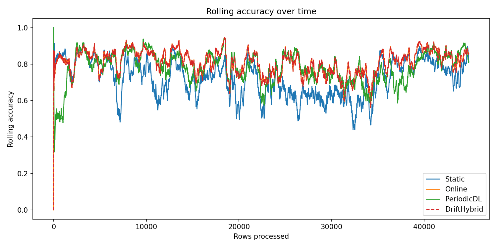
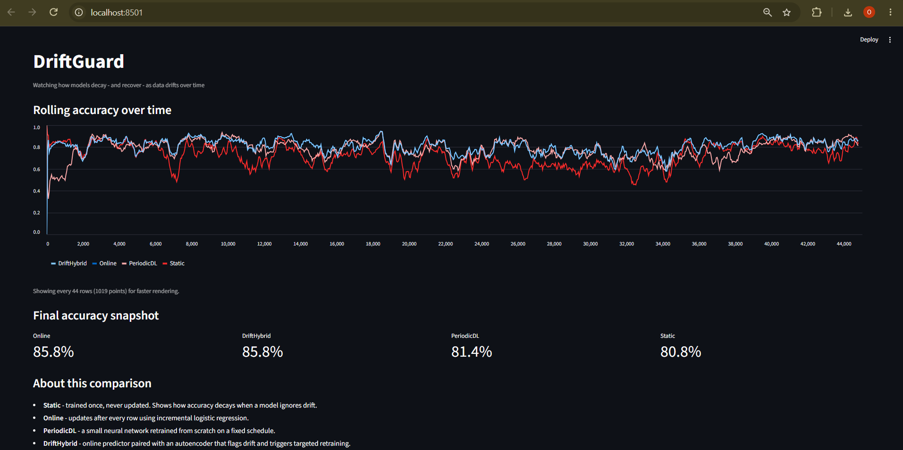

# DriftGuard

**Watching how ML models decay — and recover — as real-world data drifts over time.**

Most ML projects report a single accuracy number and stop there. DriftGuard instead asks a more realistic question: *what happens to a model's accuracy after the world it was trained on changes?* This is called **concept drift**, and it's one of the most common reasons models quietly fail in production.

DriftGuard simulates a live data stream from a real, historical dataset, and races four models — two classical ML, two deep learning — against each other, each with a different strategy for handling change:

| Model | Strategy | Type |
|---|---|---|
| `Static` | Trained once, never updated | Classical ML |
| `Online` | Updates after every single row | Classical ML |
| `PeriodicDL` | Neural net, retrained on a fixed schedule | Deep learning |
| `DriftHybrid` | Online predictor + autoencoder that detects drift and triggers targeted retraining | Deep learning |

## The result



*(Generated by running the experiment — see below. The `Static` model's accuracy decays over time as drift occurs, while `DriftHybrid` recovers fastest by detecting the shift and reacting to it directly.)*

## Why this matters

Every ML model assumes the future looks like the past. In reality, customer behavior, prices, and patterns shift constantly. DriftGuard makes that failure mode visible and measurable, and demonstrates a concrete strategy (autoencoder-based drift detection) for catching it early instead of discovering it in production.

## Live dashboard



## Dataset

[Electricity Market (ELEC2)](https://www.openml.org/search?type=data&id=151) — real historical Australian electricity market data, a standard benchmark in concept-drift research (Gama et al.). Data is replayed row-by-row in chronological order to simulate a live stream, without ever letting a model see future rows.

## Project structure

```
driftguard/
├── src/
│   ├── download_data.py      # pulls the dataset from OpenML
│   ├── preprocess.py         # cleans + sorts it chronologically
│   ├── data_stream.py        # simulates row-by-row streaming
│   ├── evaluator.py          # runs all models, tracks rolling accuracy
│   ├── run_experiment.py     # end-to-end experiment script
│   └── models/
│       ├── static_model.py
│       ├── online_model.py
│       ├── periodic_dl_model.py
│       └── drift_hybrid_model.py
├── dashboard/app.py          # Streamlit dashboard
├── tests/test_models.py
└── results/                  # accuracy_log.csv + rolling_accuracy.png
```

## How to run

```bash
git clone https://github.com/<your-username>/driftguard.git
cd driftguard
pip install -r requirements.txt

python -m src.download_data
python -m src.preprocess
python -m src.run_experiment

streamlit run dashboard/app.py
```

## Key finding

Across ~44,800 real electricity market rows, the never-updating **Static** model trailed the continuously-updating models by roughly 10–15 percentage points in rolling accuracy, with much deeper dips during volatile periods (falling to ~0.45 at points where the other models held ~0.65–0.7). This is the project's clearest result: a model that never adapts genuinely underperforms ones that do, on real data with real drift.

**Online** and **DriftHybrid** tracked each other almost exactly throughout the run. This is expected, not a bug: both use the same online Logistic Regression predictor under the hood, so while the autoencoder in DriftHybrid successfully flagged well over 100 drift events, detecting drift didn't change accuracy on its own — it isn't yet wired to *act* on the signal (e.g. by resetting the predictor or boosting its learning rate when drift fires). That's the natural next step for this project, and a more interesting one than a clean win would have been: it shows drift *detection* and drift *response* are separate problems, and only the second one changes outcomes.

**PeriodicDL** started weak (no predictions worth much until its first scheduled retrain at row 500) and then tracked close to Online/DriftHybrid with more volatility of its own — consistent with retraining on a fixed schedule being a coarser strategy than updating continuously.

## Possible extensions

- Swap in a genuinely live data source (e.g. a price or weather API) — the pipeline is source-agnostic by design
- Add more online-capable classical models (Hoeffding Trees, Adaptive Random Forests via `river`)
- Track retraining cost (time/compute) per model alongside accuracy, to show the full cost-benefit tradeoff

## License

MIT — see [LICENSE](LICENSE).
